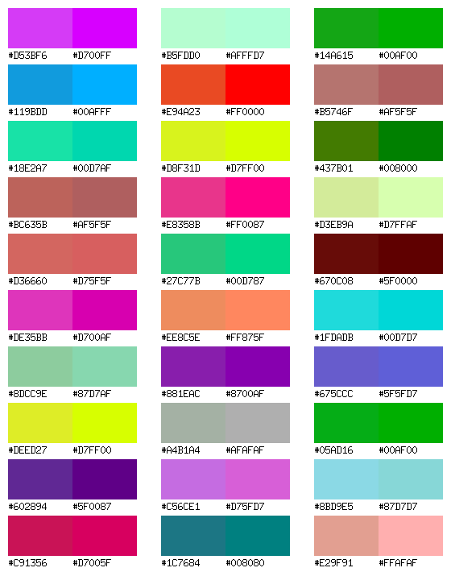

color pattern image generator
====

This program will generate a pattern image to generate some random colors and compare the calculated 256 terminal colors for each.

The output image will be as follows:

